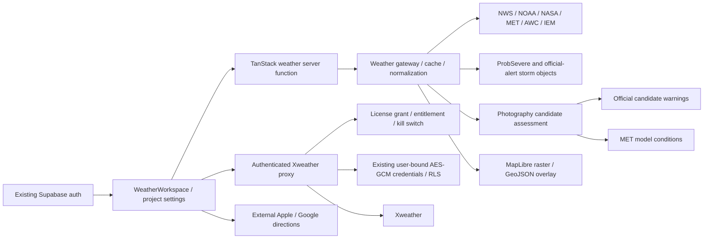

# Weather / Storm Chasing upgrade — implementation record

This extends the existing module under the complete 50-section specification received September 13, 2026. Work follows the supplied phase gates; no production release is authorized by a local test pass alone. The interrupted draft has been reconciled with that specification; existing unrelated work was preserved.

## Repository findings

- `/weather` uses `WeatherWorkspace`, the shared GIS `MapCanvas`, MapLibre overlays, the existing project snapshot, and compact mobile sheets. No new app or route is necessary.
- `gateway.server.ts` loads NWS observations/alerts, MRMS composite imagery, NOAA WMS products, MET Norway, AWC METAR, ProbSevere and IEM reports. `registry.ts` already contains public and Xweather layers. Registering a product does not make its feed operational.
- `stormIntelligence.ts` already builds storm objects and uncertainty corridors. It is not a raw Level II volume decoder or a multi-source feature-detection pipeline.
- `weather_provider_connections` stores AES-GCM encrypted Xweather credentials under user RLS. Provider identity is currently constrained to Xweather. The authenticated tile proxy resolves credentials server-side; generic commercial adapters and per-account product entitlement detection are not implemented.
- Weather navigation uses external Apple/Google directions. It does not calculate weather-aware road routes, closures, escape redundancy or terrain visibility.
- Existing Photography samples three points projected from an alert polygon. It does not consume the selected storm, a DEM, roads, camera imagery or measured lightning.
- Environment variable names were inspected without exposing local credential values. No shared database, entitlement contract, deployment or published git history was changed.

## Diagnosed defects and changes

1. Candidate warning failures were converted to an empty alert array. Removed that fallback: failures now retain unknown hazard status, suppress scoring, and show a diagnostic caution.
2. Photography reused the gateway timeout after earlier providers had spent its budget. It now has a dedicated, bounded 12-second signal.
3. Favorable model weather could yield a positive photography score without terrain, roads, escape or lightning checks. Scores are now withheld until those inputs exist; this is not yet the requested opportunity heat map.
4. Exercise/test alerts are excluded as targets. Known severe hazards remain high even when a lookup fails. Unsupported numeric confidence values were removed.
5. The first-run map-blocking chooser was removed. The Xweather connection dialog already required explicit interaction; connection management remains available.
6. Layer discovery now hides unverified layers by default, with an unavailable/optional toggle, favorites filter, and requirement cards. A public product can be checked while remaining off, then enabled after data returns. Recommended/pro-radar lists use the same visibility filter. Effective map visibility also checks availability for saved settings and presets. Browser verification of these paths remains pending.
7. Added provider licensing metadata and product-specific Xweather server approval. Both tile proxy and commercial frame generation fail closed without the explicit, expiring server-owned product grant for the authenticated user or application. Key testing requires approval too. The proxy disables caching until retention rights are established and does not expose upstream network-error text that could contain a credential URL. Open-Meteo evaluation is restricted to development mode.

## Licensing references reviewed

- NOAA/NWS disclaimer: https://www.weather.gov/disclaimer
- MET Norway API terms: https://api.met.no/doc/TermsOfService
- Open-Meteo hosted API terms: https://open-meteo.com/en/terms
- NOAA Level II access: https://www.ncei.noaa.gov/products/radar/next-generation-weather-radar
- NOAA HRRR inventory: https://www.nco.ncep.noaa.gov/pmb/products/hrrr/

Public-provider policy applies to qualifying government-origin products, not every third-party dataset carried by a government service. Commercial contracts have not been provided; registry entries are not license approvals. Unreviewed provider links are discovery references, not proof of rights.

The initial bare `WEATHER_XWEATHER_LICENSED_PRODUCTS` allowlist has been replaced by versioned, expiring license grants under `WEATHER_PROVIDER_POLICY`. A valid key or successful request is not a rights grant. Existing credentials are preserved. Approval does not itself verify a user's product subscription. Server functions and proxy bindings must resolve the same policy.

## Remaining work — not delivered as operational features

- Database-backed license review/evidence, expiry/revocation, administrative approval and per-user/product entitlement checks; managed credentials and additional BYOK/OAuth adapters.
- Full requested catalog groups, recurring health refresh, per-product geography verification, and browser validation of all mode switches. Favorites, recent-use filtering, category discovery and effective render gating are implemented locally.
- Level II volume ingestion/decoding, tilts, cross sections, rotation/CC/ZDR analysis; expanded operational MRMS, GOES/GLM and HRRR/model products.
- SPC severe outlooks, expanded AWC products, mesonets, boundary analysis, licensed roads/cameras, private weather stations and chaser reports.
- Independent-source storm fusion with evidence freshness and traceable explanatory factors.
- Selected-storm Photography analysis, actual DEM terrain line-of-sight, weather-aware routing, safety gates, spatial opportunity scoring and heat-map rendering. No terrain or road evidence is fabricated.
- End-to-end browser/mobile validation and operational provider/license validation before release.

These changes have not been deployed. Do not describe this foundation as the complete storm-chasing upgrade.

## Phase 0 architecture and dependency map

The existing pipeline elevation interfaces (`src/lib/pipeline/elevation.ts`) can be reused for sample provenance and geometry revision. Only manual interpolation is implemented there; USGS is planned and Esri needs configuration. Manual interpolation must never masquerade as measured terrain in an observation recommendation. No operational topography/road graph worker or queue was found in the Weather path. Existing telemetry is process-local, not a durable operations dashboard.

Current provider inventory is also captured in `providerRegistry.ts` and product-to-layer mappings in `productRegistry.ts`. The baseline does not ingest nationwide Level II volumes. Forecast rasters, station observations and alerts have distinct existing normalized types; all retain source metadata.

## Decisions and proposed normalized storage

- Keep existing TanStack/MapLibre routes and stable weather layer IDs. Add services around these contracts rather than replacing the workspace.
- Separate legal approval from credential validity and product entitlement. An HTTP 200 is neither a license grant nor permission for other users to consume BYOK data.
- Bootstrap policy from server-owned configuration with strict validation, version, expiry and revocation. Prepare additive SQL for durable review records; activate that store only after shared-schema integration and database tests.
- Existing per-user credentials remain per-user. Do not invent an organization membership table or promote a personal subscription to organization-wide access. Organization support must use the application's eventual authoritative membership contract.
- Proposed durable records: provider/product, license review, connection, entitlement, health/audit events; later observation/forecast field, official alert, storm/history/feature, analysis factor/confidence, candidate/score/exclusion, route/road condition, camera/chaser report and quality event. Derived records carry processing/algorithm versions and immutable input references.
- Time-index observation and event tables; use PostGIS indexes only once the installed spatial extension and the tenant model are verified. Define retention per product license and user consent. No precise-location analytics.
- Core safety exclusions have no user preference override. Unreviewed derived recommendations remain disabled even if their numerical scoring implementation exists.

## Implementation sequence and gates

| Phase / release           | Repository components                                                   | Migration / new service                                     | Acceptance and rollback                                                                                      |
| ------------------------- | ----------------------------------------------------------------------- | ----------------------------------------------------------- | ------------------------------------------------------------------------------------------------------------ |
| 0 Discovery               | Weather, auth, pipeline elevation, server entry, migrations             | Report and baseline fixtures only                           | Document unresolved dependencies and actual versus code-reproduced failures                                  |
| 1 Foundation / A          | provider/product registries, policy, proxy, connection UI, server entry | Additive license/entitlement schema; strict policy resolver | Revocation, tenant isolation, no secrets, direct workspace entry; provider kill switch                       |
| 2 Layers / A              | layer availability, model, workspace, overlay, timeline                 | Availability and freshness contracts                        | No blank activation; groups/search/recent/favorites; responsive and historical-state QA; UI flag rollback    |
| 3 Official / A–B          | gateway, alert normalization, SPC/AWC adapters                          | Official-product retention                                  | Official alerts independent; stale/historical labels; adapter rollback                                       |
| 4 MRMS/GOES/GLM / B       | public adapters, tile/time services                                     | Ingestion and licensed cache                                | Accurate frame times and missing-frame degradation; per-product kill switches                                |
| 5 Level II / C            | radar service, worker, local interrogation UI                           | Volume decoding/object storage worker                       | Tilt/quality/range tests; expert signature review; disabled by default                                       |
| 6 HRRR/surface / C        | model adapters, surface and boundary analysis                           | Forecast fields/time series                                 | Observed/forecast distinction; missing-data confidence; algorithm flag                                       |
| 7 Storm objects / C       | storm engine, history, evidence cards                                   | Versioned storm/history/factor storage                      | Split/merge/association and expanding uncertainty; revert algorithm version                                  |
| 8 Photo repair / D        | photography service, gateway, UI                                        | Error instrumentation                                       | Representative successes and explained failures; no heat-map release yet                                     |
| 9 Terrain/opportunity / D | reuse elevation contracts; LOS/scoring/overlay                          | DEM workers and candidate storage                           | Legal access, hard safety gates, component explanations and expert review; analysis kill switch              |
| 10 Routing / E            | routing adapter, GPS, route UI                                          | Road graph/routes/invalidation                              | No unsafe fabricated fallback; closures and moving hazards; routing kill switch                              |
| 11 Premium / F            | approved vendor adapters, usage, vault                                  | Per-subject entitlements/rotation                           | Executed rights, isolation, expiry/revocation, cost controls                                                 |
| 12 Supplementary / E–F    | camera/station/report services                                          | Private sensors/media/report moderation                     | Explicit sharing, retention, unofficial labels and abuse controls                                            |
| 13 Review                 | historical replay and validation harness                                | Review evidence only                                        | Qualified meteorological/operational/security/accessibility review; unresolved critical issues block release |
| 14 Rollout                | flags, telemetry, runbooks                                              | Durable monitoring and review scheduling                    | Internal → expert alpha → regional beta → approved GA; no automatic scheduling created                       |

## Risk register

| Risk                                                             | Control / release blocker                                                                    |
| ---------------------------------------------------------------- | -------------------------------------------------------------------------------------------- |
| Technically accessible third-party data mistaken for public data | Product-level rights, provenance and explicit unknown classification                         |
| Credential validity mistaken for license or subscription         | Separate grant and per-account product test; fail closed                                     |
| Shared worker leaks another user's status/cache                  | User-bound authorization and private/no-store commercial responses; no global account health |
| Empty/failed alerts imply safety                                 | Explicit failure state and official-alert independence                                       |
| DEM resolution, roads, private land or escape data absent        | Unknown inputs withhold usable recommendations                                               |
| Cloudflare request budget exhausted by radar/DEM                 | Queued bounded workers; no heavy synchronous browser processing                              |
| Saved layer/preset bypasses availability                         | Check effective render state and activation paths                                            |
| Historical data presented as current                             | Separate time modes and suppress live-routing recommendations in playback                    |
| Production schema conflicts with admin workstream                | Additive unapplied migration and explicit membership integration gate                        |
| Apparent success without field validation                        | Definition-of-Done checklist and expert-review release gate                                  |

## Baseline and validation plan

The interrupted draft passed 45 weather tests, TypeScript, scoped ESLint and production build. Local Vite starts at `http://127.0.0.1:5173/weather`; the browser reaches the existing LandDraft sign-in screen. An authenticated local browser session is required for workspace screenshots and end-to-end UI validation. Authentication was not bypassed and no account was created for testing.

Automated additions cover malformed/expired/revoked policy, unsupported connection mode, cross-user grants, rate-limit and vendor failures, redacted errors, empty versus failed observations, staleness, and availability changes. Commercial fixtures are synthetic. Pending database checks: apply/reapply migration in a disposable database, inspect privileges/RLS, attempt cross-user reads/writes, verify rollback. Pending browser matrix: desktop 1440×900; iPad 1024×768 and 768×1024; phone 390×844 and 844×390; large text, keyboard, safe areas and light/dark styles. Do not mark these pending checks passed.

Manual QA: open Weather with no chooser; open Data Sources from Settings; inspect a disabled product and its requirements; test an approved connection, rotate it, disconnect it; simulate 401/403/429/timeout; confirm unrelated public layers continue; change map location during loading; apply a preset with unavailable layers; verify no stale/failed data becomes a safety recommendation.

Performance targets for the foundation: 12-second maximum vendor probe, 35-second target complete point-response budget, no repeated automatic commercial probes, cancellation of superseded browser requests, no commercial response caching absent explicit retention rights. These are design targets, not measured production service levels. Advanced ingestion needs independent latency/load targets before implementation.

## Foundation verification and release status

Local verification on September 13, 2026: 56 weather tests, TypeScript, scoped ESLint, and the production build pass. The Vite build reports the existing tsconfig-paths migration advisory. No deployment or shared database migration was performed.

Implemented locally: provider/product registries; strict versioned license policy; request-isolated policy context; immediate credential revocation checks; encrypted existing Xweather credential workflow; per-product connection tests; bounded request bodies; per-user process-local rate controls; redacted audit records; centralized grouped Data Sources; startup chooser removal; availability-aware activation and rendering; favorites/recent filters; independent NWS alert lookup; conservative Photography failure handling.

The additive migration and rollback are prepared, not database-validated. Runtime authorization uses server configuration and the existing credential table; the new durable governance tables are not yet the runtime policy source. Audit and rate controls are process-local and require durable/distributed enforcement before scaling. LandDraft-managed credentials and additional vendors remain adapter/schema work, not working connections. User grants are isolated; organization-wide permissions require an authoritative organization-membership model.

Superseded browser requests are cancelled. Shared public upstream work uses bounded timeouts independently of a single subscriber's cancellation so one caller cannot cancel another caller's deduplicated request.

Release gates still blocked: a disposable Supabase/Postgres environment for migration/RLS/rollback tests; an authenticated local browser session for the desktop/iPad/mobile workflow and screenshot matrix; documented commercial rights for enabled premium products; operational ingestion/DEM/road infrastructure and qualified expert review for advanced safety analysis. The development browser currently reaches the existing sign-in screen. No authenticated workspace or visual-regression pass is claimed.

This is an independently reviewable foundation increment, not completion of Release A or the entire specification. No uncertain commercial product, opportunity heat map, safe observation recommendation, or hazard-aware route is activated by this work. The next sequence remains database/security and authenticated UI validation, then remaining Release A official-product work, before progressing through the documented phase gates.

## Signed-in browser QA — September 13, 2026

The user supplied an authenticated local browser session. The preview initially failed all external public-provider requests because the development process ran inside the network sandbox. A read-only NWS probe returned HTTP 200 with approved network access; restarting the localhost-only development server with that access restored NWS observations/alerts, MRMS, ProbSevere and IEM results. This was an environment failure, not evidence that the providers were down.

Verified through actual browser interaction: direct Weather entry without the chooser; optional layers off by default; unavailable Xweather product requirement card; navigation from that card into Data Sources; provider search; disabled licensing/connection state; public MRMS layer activation and visible radar rendering; no-target Photography explanation. No provider credentials were entered, no location permission was granted, and no project-save action was taken. Radar visibility and the original category were restored after testing.

Visual checks covered 1440×900 desktop, 1024×768 iPad landscape, 768×1024 iPad portrait, 390×844 phone portrait, and 844×390 phone landscape. These were viewport checks in the signed-in in-app browser, not physical-device certification or a full automated visual-regression suite. Temporary viewport overrides were reset.

Browser findings fixed: saved-but-unavailable layers inflated the active count and legends; paused layers now have explicit reasons and effective counts. Failed/stale alert feeds could display zero alerts; the status badge and inspector now report unknown/unavailable status. Landscape sheets covered most of the usable map; short-height layouts now use a narrow side drawer. The tablet header now uses the workspace selector below desktop width. Close and layer-order controls have larger touch targets, layer names wrap, and layer search has an explicit accessible label. The Xweather form now disables credential entry/submission while encryption configuration or product approval is missing.

Still pending: valid licensed commercial connection lifecycle, durable database/RLS/rollback tests, physical-device browser chrome/keyboard/large-text checks, complete dark-mode and color-vision regression, historical hazard synchronization, and the remaining releases. This local deployment reports server-not-configured for secure Xweather connections and has no approved commercial grant. Authentication is no longer the blocker for ordinary workspace QA; staging database access and premium configuration remain blockers for their respective gates.

## Isolated PostgreSQL validation — September 13, 2026

Added `tools/weather-db`, a standalone locked PGlite 0.5.8 test package. No application dependency or runtime policy source changed. Eight database scenarios (nine Node test results including the parent suite) pass on an in-memory PostgreSQL engine: migration apply/reapply, RLS enabled, default-disabled products, anonymous restrictions, per-user entitlements/audit, rejection of unauthorized governance writes, license constraints, existing credential isolation/disconnect, rollback preserving credentials, and reinstall.

This supersedes the earlier lack of local database validation. It does not satisfy hosted Supabase integration: the harness creates minimal synthetic auth/role/trigger contracts and does not test PostgREST, Auth issuance, installed hosted privileges/extensions or the complete shared schema. No real database or user records were changed.

The admin architecture identifies a test project, but no authorized SQL connection to it is configured here. The current preview database could not be classified as the designated test environment; no migrations were sent to it. Server credential encryption and commercial license grants remain unconfigured. No new encryption key was generated against an existing credential store, and no commercial rights were fabricated.

Reproduction commands, fixture limits, staging checks, rollback precautions and secret configuration are in `tools/weather-db/README.md`. The next hosted step needs an authorized SQL session to the designated test Supabase project, then staging-only auth/PostgREST tests and migration evidence. Configure secrets through server secret management, never chat or browser-visible variables.

## Hosted staging update

The designated test project was inspected through the user's signed-in dashboard.
Rollback-only hosted DDL and synthetic-user RLS rehearsals passed. The six-table
empty Weather foundation was then committed to test only. Anonymous PostgREST
checks passed. A separate localhost preview on port 5174 now targets that project
with a new server-only encryption key for its empty credential store and zero
commercial grants. Production, recovery and the existing preview configuration
were not changed. See `WEATHER_STAGING_VALIDATION.md` for backup evidence, source
hashes, migration-ledger limitations, checks and remaining gates.
